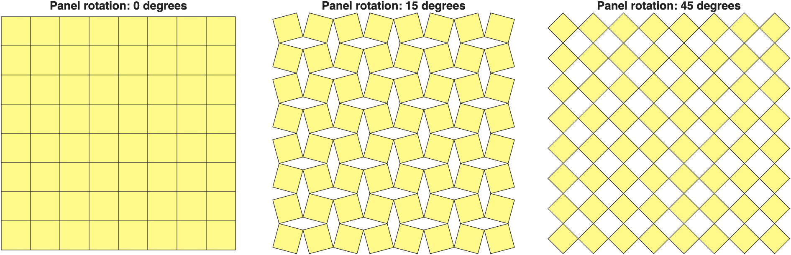
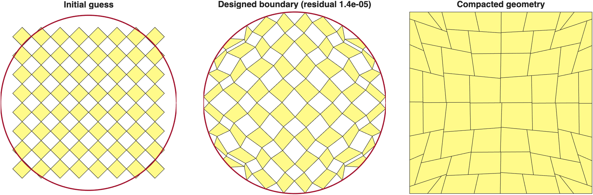

# Inverse design of shape-morphing kirigami

**From a desired boundary to a cut pattern — then from kinematics to mechanics.**

Research code accompanying [*Inverse design of programmable shape-morphing kirigami structures*](https://doi.org/10.1016/j.ijmecsci.2024.109840), Xiaoyuan Ying, Dilum Fernando and Marcelo A. Dias, *International Journal of Mechanical Sciences* **286**, 109840 (2025). [Open preprint](https://arxiv.org/abs/2406.10566).


*A small example generated by this repository. Panel rotation is kinematic; this picture does not represent an elastic simulation.*

## The idea

Cut a sheet into connected panels and it can change shape when pulled. The inverse problem is to choose those cuts so that the deployed sheet reaches a specified outline.

The paper treats two design classes separately. **Non-rigid deployable** designs satisfy compatibility in the compact and target configurations, but the transition may require panel deformation. **Rigid-deployable** designs add parallelogram-void conditions so that panels can rotate through a continuous deployment path. A second optimisation stage accounts for elastic ligaments and applied loading using finite elements.


[Visual explanation](docs/paper-guide.md) · [Reproducibility and requirements](docs/reproducibility.md) · [Detailed solver reference](docs/kinematics-reference.md)

## Start here

Clone this repository, open MATLAB in its root folder, then run:

```matlab
setup_project
demo_deployment                    % rotating panels; base MATLAB
result = demo_inverse_design('rigid'); % requires Optimization Toolbox
result.diagnostics                % check feasibility, not just the picture
```

For the other constraint set:

```matlab
result = demo_inverse_design('nonrigid');
assert(result.diagnostics.converged)
```

Each example saves its geometry and figure in a new folder under `results/`. Inverse-design runs also save their settings, random seed, MATLAB version and constraint residuals. The demonstration tolerance is `1e-4` in the model's coordinate scale; choose tolerances appropriate to your own design.



## Repository layout

| Folder | Purpose |
|---|---|
| `examples/` | Small, self-contained starting points |
| `src/kinematics/` | Geometry, rigid/non-rigid constraints, optimisation and export |
| `src/comsol/` | MATLAB–COMSOL model construction and GA helpers |
| `legacy/` | Original drivers and selected saved cases; require case-specific setup |
| `extras/forward-analysis/` | Additional rotating-unit studies; separate from the paper examples |
| `docs/` | Paper explanation, numerical notes and source provenance |
| `tests/` | Geometry invariants and data-conversion checks |
| `results/` | Generated runs, ignored by Git |

The two paper repositories define some functions with the same names. Use one project at a time; do not add both recursively to your MATLAB path. `setup_project` changes only the current session and does not call `savepath`.

## Scope and verification

This is a cleaned version of the **maintained research code**, including changes made after publication. It is not a frozen archive that reproduces every published figure. Core numerical equations were retained during this cleanup; new examples make inputs and diagnostics explicit. See [the validation record](docs/validation.md) for exactly what was run.

COMSOL refinement is kept as an advanced workflow. The old drivers assume variables in the MATLAB workspace and use case-specific material/loading settings. They are not presented as one-command reproduction scripts. [Read the COMSOL notes first](docs/reproducibility.md#mechanical-refinement).

Run the lightweight checks with:

```matlab
setup_project
results = runtests('tests');
assertSuccess(results)
```

## Cite and reuse

Please cite the paper when using its method. [`CITATION.cff`](CITATION.cff) supplies citation metadata. The repository has no project-wide software licence yet; see [rights and attribution](RIGHTS.md).
