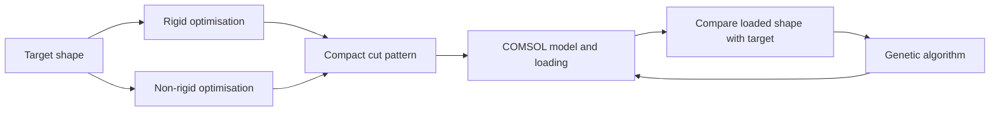
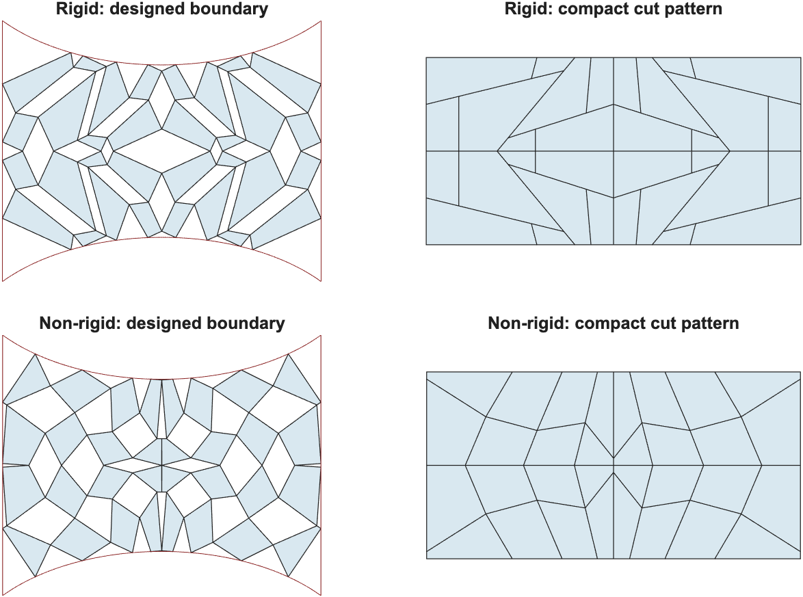

# Inverse design of 2D kirigami

Research code for [*Inverse design of programmable shape-morphing kirigami structures*](https://doi.org/10.1016/j.ijmecsci.2024.109840) — Xiaoyuan Ying, Dilum Fernando and Marcelo A. Dias, *International Journal of Mechanical Sciences* **286**, 109840 (2025).

The project has **two stages**:

1. **Kinematic inverse design:** find a compact cut pattern for a target outline, with separate rigid and non-rigid deployability constraints.
2. **Mechanical refinement:** turn that pattern into a finite-width ligament model in COMSOL, apply displacement, and use a genetic algorithm to reduce the loaded boundary's shape error.



## Run the kinematic design

Open MATLAB in this folder:

```matlab
rigid = main_rigid;
nonrigid = main_nonrigid;
```

Change the grid, target and solver settings in [`config/kinematic_config.m`](config/kinematic_config.m). Both commands return a result and save `kinematic_result.mat` in a new `results/` subfolder. Check `result.diagnostics.converged` before using the cut pattern.


*Generated from the default kinematic examples. Red curves show the target profiles; these are ideal panel geometries, before elastic refinement.*

## Run mechanical refinement

Connect MATLAB to COMSOL LiveLink, review [`config/mechanical_config.m`](config/mechanical_config.m), then pass the kinematic result:

```matlab
mechanical = main_comsol(rigid);  % or main_comsol(nonrigid)
% Alternatively: main_comsol('results/<run>/kinematic_result.mat')
```

The COMSOL model is built from code. **No `.mph` files are required or tracked.** The GA saves a checkpoint after each generation and stops at the shape-error tolerance, generation limit, or stall limit; it does not guarantee a target will be reached.

The inherited mechanical parameterisation uses symmetric patterns: rigid refinement supports **2 × 4** units; non-rigid refinement supports even rectangular grids. It currently evaluates ellipse, vase and wavy boundaries. Unsupported or unconverged inputs are rejected explicitly. See the [workflow guide](docs/workflow.md) for setup, units and settings, and the [validation record](docs/validation.md) for tested limits.

## Check the setup

```matlab
setup_project
assertSuccess(runtests('tests'))
```

These fast checks cover geometry, shape definitions, pattern encoding and the genetic-algorithm driver. They do not require COMSOL; a full mechanical run needs a connected, licensed COMSOL server.

## Where things belong

| Location | Contents |
|---|---|
| `main_rigid.m`, `main_nonrigid.m` | The two kinematic entry points |
| `main_comsol.m` | COMSOL and genetic-algorithm entry point |
| `config/` | Settings to edit before a run |
| `src/kinematics/` | Geometry, optimisation and the two constraint sets |
| `src/shapes/` | Shared target definitions, boundary residuals and plotting |
| `src/mechanics/` | Cut-pattern encoding, COMSOL model, shape error and GA |
| `tests/` | Geometry and workflow checks |
| `results/` | Local generated output, excluded from Git |

MATLAB with **Optimization Toolbox** is needed for kinematic optimisation. Mechanical refinement also needs **COMSOL, LiveLink for MATLAB and the structural mechanics features used by the model**. The serial GA needs no Global Optimization Toolbox.

This is maintained research code, not a frozen reproduction of every paper figure. Citation metadata is in [`CITATION.cff`](CITATION.cff); reuse terms are in [`RIGHTS.md`](RIGHTS.md).
