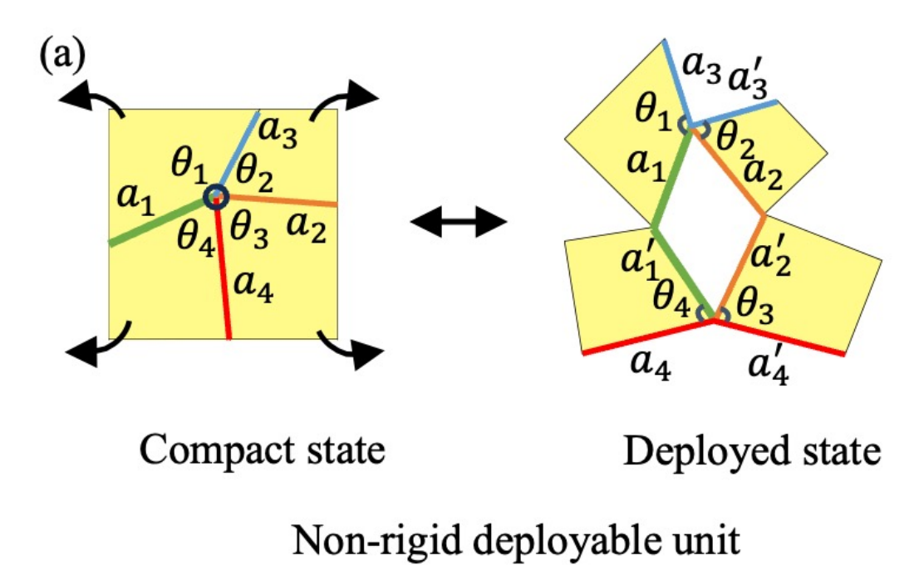
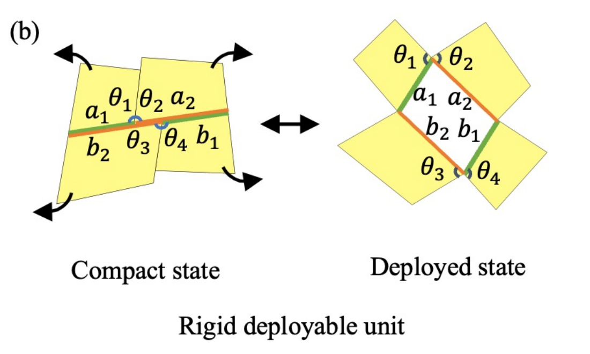
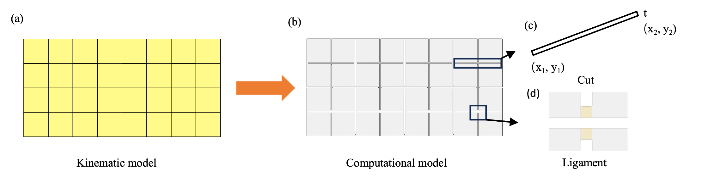

# A quick guide to the paper

## 1. Choose how the sheet is allowed to move

| Non-rigid deployable | Rigid-deployable |
|---|---|
|  |  |
| Matching edge lengths and angle sums make the compact and deployed states compatible. These endpoint conditions alone do not guarantee a rigid path between them. | Additional equal-edge and angle conditions make the deployed voids parallelograms, allowing a continuous path by panel rotation. |

Both classes also enforce non-overlap, compact-state compatibility and the desired boundary. In the code, start with `src/kinematics/constraints/nonrigid.m` and `rigid.m`. Node coordinates are the design variables.

## 2. Work backwards from the target

`fit_initial_guess` selects an initial opening and scale. `tessellation_optimization` changes node positions while enforcing the chosen constraints. `tessellation_compaction` closes the resulting layout to recover a compact pattern.

A smooth-looking image is not proof of a valid design. Inspect `result.diagnostics`: nonlinear equalities, inequalities and linear hinge constraints must all satisfy the stated tolerance. Options such as free scale, symmetry and minimum edge length alter the optimisation problem; the example records them explicitly.

## 3. Add the mechanics of real ligaments

Real cuts leave narrow ligaments. Their bending, stretching and shear affect the shape under load. The second stage couples a genetic algorithm to COMSOL so that the mechanically deformed boundary can be compared with the target. This is distinct from the first stage's rigid-panel geometry.

**Where to look:** `src/comsol/livelink*.m` constructs model variants; `legacy/comsol/GGA*.m` contains the corresponding research drivers. Their mesh, loading, material and target settings must be matched to the case being studied.

Figures above come from the authors' paper assets; [provenance](figures/README.md). They are explanations of the published method, not output from the new quick-start run.
